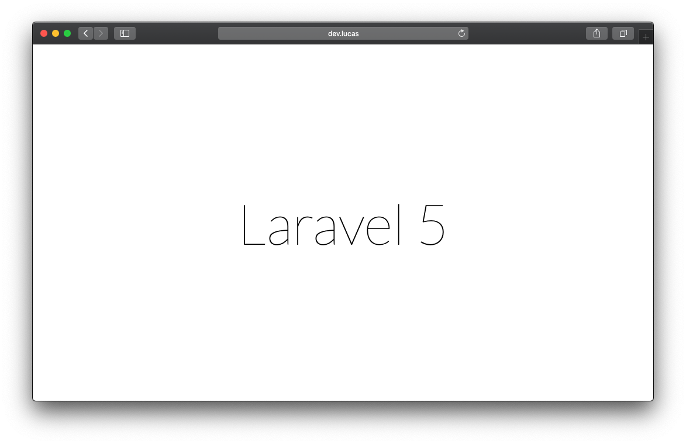

name: capa

.capa-titulo[

# Soluções WEB

]

.capa-subtitulo[

### Prof. Lucas Ferreira

]

---

class: center, middle
count: false

# PHP Moderno e seus Frameworks

.center[.php-img[]]

---

## Paradigmas de programação

O PHP é uma linguagem dinâmica e flexível, que suporta uma variedade de técnicas de programação, como programação funcional e OOP.

--

Dada a evolução constante da linguagem com o passar dos anos, o PHP ganhou em sua versão 5.0 um sólido modelo de orientação a objetos.

--

O PHP atualmente possui um conjunto completo de funcionalidades de programação orientada a objetos, incluindo suporte à classes, classes abstratas, interfaces, herança, construtores, clonagem, exceções e muito mais.

--

E em sua versão 5.3 lança o suporte a **namespaces**.

---

## Namespaces

Com o amadurecimento do ecossistema de desenvolvimento PHP impulsionado pela modernização da linguagem, diversos projetos, frameworks, bibliotecas e utilitários surgem em meio a comunidade open-source.

Mas o que fazer quando você precisa utilizar um pacote de terceiros chamado `DBO` e em seu projeto também existe uma classe sua chamada `DBO`?

Os **Namespaces** resolvem esse problema. Como descrito no manual de referência do PHP, os namespaces podem ser comparados com os diretórios dos sistemas operacionais, que fazem namespace dos arquivos; dois arquivos com o mesmo nome podem coexistir em diretórios separados.

Da mesma forma, duas classes PHP com o mesmo nome podem coexistir em namespaces PHP separados. Simples assim.

---

## Namespaces

Antes da implementação de _namespaces_ no PHP isto seria um problema:

```bash
- projeto
  - Produto
      Cadastro.php
  - Cliente
      Cadastro.php
```

--

Sendo que o conteúdo de `projeto/Produto/Cadastro.php`:

```php
<?php
class Cadastro {
  public function save() {
    echo "salva o Produto no banco";
  }
}
```

--

Sendo que o conteúdo de `projeto/Cliente/Cadastro.php`:

```php
<?php
class Cadastro {
  public function save() {
    echo "salva o Cliente no banco";
  }
}
```

---

## Namespaces

Neste exemplo caso precisássemos cadastrar na mesma _requisição_ um cliente e um produto teríamos um problema:

```php
<?php
require("Produto/Cadastro.php");
require("Cliente/Cadastro.php");

$produto = new Cadastro();
$produto->save();
```

--

Teremos o seguinte erro:

**`Fatal error: Cannot redeclare class Cadastro in /vagrant-www/labs/satc/slides-sw-aula-09/demo/projeto/Cliente/Cadastro.php on line 2`**

--

Ou seja, sem o uso de namespace não podemos conflitar nome de classes, objetos ou bibliotecas.

---

## Namespaces

Para resolver o problema proposto nos slides anteriores, bastaríamos definir os namespaces de cada classe `Cadastro`:

--

Nova versão de `projeto/Produto/Cadastro.php`:

```php
<?php
namespace Produto;

class Cadastro {
  public function save() {
    echo "salva o Produto no banco";
  }
}
```

--

Nova versão de `projeto/Cliente/Cadastro.php`:

```php
<?php
namespace Cliente;

class Cadastro {
  public function save() {
    echo "salva o Cliente no banco";
  }
}
```

---

## Namespaces

E agora nós podemos usar as duas classes sem conflito:

```php
<?php
require("Produto/Cadastro.php");
require("Cliente/Cadastro.php");

$produto = new \Produto\Cadastro();
$produto->save();

echo "<br />";

$cliente = new \Cliente\Cadastro();
$cliente->save();
```

--

# 👍

---

## Namespaces

**Antes de avançarmos:** um exemplo do mundo real aonde não seria viável "viver" sem namespaces.

Imagem que em um projeto vocês precisam implementar dois meios de pagamento em sua aplicação: **PagSeguro** e **Cielo**.

--

Ambos gateways de pagto possuem suas implementações oficiais em PHP:

<https://github.com/pagseguro/pagseguro-php-sdk>

<https://github.com/DeveloperCielo/API-3.0-PHP>

---

## Namespaces

Agora que já temos ambas as bibliotecas oficiais instaladas, suponha que precisamos trabalhar com a classe `CreditCard` do PagSeguro:

<https://github.com/pagseguro/pagseguro-php-sdk/blob/master/source/Services/DirectPayment/CreditCard.php>

--

E que também precisássemos usar a classe `CreditCard` da Cielo:

<https://github.com/DeveloperCielo/API-3.0-PHP/blob/master/src/Cielo/API30/Ecommerce/CreditCard.php>

--

_É justamente essa **segurança** que o uso de namespace nos da_.

---

## autoload

Uma vez que nossos projetos PHP estejam devidamente organizados e estruturados usando OOP, necessitaremos pensar em uma forma mais fácil de carregar os arquivos "componentizados".

--

Em um de nossos exemplos anteriores utilizamos a função `require`:

```php
<?php
require("Produto/Cadastro.php");
require("Cliente/Cadastro.php");

$produto = new \Produto\Cadastro();
...
```

--

De fato não a **nada de errado** com a função `require` e `include`, mas vale observar que quanto maior for o projeto, maior a quantidade de namespaces envolvidos, pacotes seus misturados com bibliotecas de terceiros _(ex: Cielo, Pagseguro)_.

--

Em cenários como estes podemos utilizar as funções de **autoload** do PHP 💥

---

## autoload

O conceito básico de um projeto que possui "pontos" de `autoload` definidos é que sempre que você precisar usar uma nova classe em um determinado momento de sua requisição, bastaria apenas instanciar a classe:

```php
<?php
$produto = new \Produto\Cadastro();
$cliente = new \Cliente\Cadastro();
```

--

Para conseguirmos "habilitar" a funcionalidade do `autoload` precisamos definir uma função que vá fazer o trabalho de "gerenciamento de inclusão":

```php
<?php
function autoloadDemo($className) {
  $classFile = str_replace("\\", "/", $className) . ".php";
  require_once (__DIR__ . '/' . $classFile);
}

spl_autoload_register('autoloadDemo');
```

--

Podemos salvar o trecho de código acima como `autoload.php`.

---

## autoload

Uma vez que já tenhamos nossa função responsável por "capturar" qualquer solicitação de uso de classes no PHP, não podemos esquecer de registrar a mesma com o método **`spl_autoload_register`**.

--

Feito isto basta carregarmos nosso `autoload.php` em nossa aplicação e utilizar as classes diretamente sem `require`:

```php
<?php
require_once("autoload.php");

$produto = new \Produto\Cadastro();
$produto->save();

echo "<br />";

$cliente = new \Cliente\Cadastro();
$cliente->save();

echo "<br />";

$carro = new \Carro();
$carro->anda();
```

---

## autoload

Outra forma de indicarmos ao mecanismo de _autoload_ a necessidade futura de uso de uma classe é diretiva `use`:

```php
<?php
require_once("autoload.php");

use \Produto\Cadastro;

$produto = new Cadastro();
$produto->save();
```

--

Podemos pensar no **`use`** como o `import` do Java 🤯

---

## Composer

Toda linguagem de alto nível com contribuições ativas de sua comunidade possui um "gerenciador de dependências".

Em Java temos o `Maven`, em JavaScript/Node temos o `NPM`, em Go temos o `get` e em **PHP temos o Composer**.

--

O **Composer** é o gerenciador de dependências recomendado para PHP, com poucos comandos simples, o Composer irá fazer o download das dependências do seu projeto automaticamente e configurará o **autoloading** para você.

--

Uma vez que você tenha o composer instalado em seu sistema e também configurado em seu projeto, para adicionar uma dependência basta usar o comando `require`:

```bash
composer require twig/twig:^2.0
```

```bash
composer require pagseguro/pagseguro-php-sdk:^5.0
```

--

Semelhante ao `npm install` usando o comando acima o composer se encarregará acessar o repositório oficial, baixar todos os arquivos necessários e depositar na pasta indicada de seu projeto.

---

## Instalando o Composer

A forma mais segura é fazer o download do composer seguindo as instruções oficiais:

<https://getcomposer.org/download/>

--

Para usuários **Windows** a forma mais fácil de obter e executá-lo é usar o instalador `ComposerSetup` (<https://getcomposer.org/Composer-Setup.exe>), que realiza uma instalação global e configura seu `$PATH` de modo que você possa executar o comando composer de qualquer diretório pela linha de comando.

Este outro link também pode ser útil para usuários do Windows: <https://www.thecodedeveloper.com/install-composer-windows-xampp/>

---

## Frameworks PHP

Em vez de reinventar a roda, muitos desenvolvedores PHP usam frameworks para construir aplicações web.

Os frameworks abstraem muitas das preocupações de baixo nível e fornecem interfaces úteis e fáceis de utilizar para completar tarefas comuns.

--

Dentre os vários tipos de frameworks PHP podemos destacar os **Micro Frameworks** e os **Full-Stack Frameworks**.

--

Os micro-frameworks focam em rotear uma requisição HTTP para um callback ou controller, da forma mais rápida e fácil possível, e algumas vezes possuem algumas bibliotecas para auxiliar no desenvolvimento, como por exemplo pacotes básicos para bancos de dados.

Quando um framework adiciona um número considerável de funcionalidades além do que está disponível em um micro-framework e passa a ser conhecido como framework completo ou full-stack. Estes normalmente possuem soluções para ORMs _(Banco de Dados)_, métodos de autenticação/login e etc.

--

A maioria dos frameworks populares desenvolvidos para PHP seguem de alguma forma o **padrão MVC**.

---

## Padrão MVC

Este padrão de arquitetura começou a ser citado no mercado de softwares em 1979, tendo sua primeira "versão concreta" concebida por Trygve Reenskaug, então funcionário da corporação Xerox PARC.

A implementação original foi descrita no artigo _“Applications Programming in Smalltalk-80: How to use Model-View-Controller”_.

A ideia de Reenskaug gerou um padrão de arquitetura de aplicação cujo objetivo é separar o projeto em três camadas independentes, que são o **M**odelo, a **V**isão e o **C**ontrolador.

A utilização do padrão MVC trás como benefício isolar as regras de negócios da lógica de apresentação/interface com o usuário.

Isto possibilita a existência de várias interfaces _(telas)_ com o usuário que podem ser modificadas sem que haja a necessidade da alteração das regras de negócios, proporcionando assim muito mais flexibilidade e oportunidades de reuso das classes.

---

## Padrão MVC

Este padrão não está restrito a WEB, nem somente ao PHP. É possível aplicar o padrão MVC em qualquer linguagem ou ambiente de utilização.

--

O modelo **(model)** consiste nos dados da aplicação, regras de negócios, lógica e funções.

--

Uma visão **(view)** pode ser qualquer saída de representação dos dados, como uma tela contendo uma tabela ou um diagrama.

--

O controlador **(controller)** faz a mediação da entrada através de lógica, convertendo-a em comandos para o modelo ou visão.

--

Numa analogia prática, o **Model** representará a fonte de dados (banco, tabelas e etc) para um projeto, o **Controller** irá solicitar, receber e manipular os dados obtidos através do _Model_ e finaliza enviando estes dados a **View** para que a mesma projete em tela de maneira útil.

--

Existem diversos frameworks populares no mercado que utilizam o padrão MVC, dentre eles: `Laravel`, `CakePHP`, `Symfony`, `Yii Framework` e `CodeIgniter`.

---

## CakePHP

O **CakePHP** é um framework escrito em PHP que tem como principais objetivos oferecer uma estrutura que possibilite aos programadores de PHP de todos os níveis desenvolverem aplicações robustas rapidamente, sem perder flexibilidade.

Sua primeira versão estável foi lançada em Abril de 2005 e já possuía todos os conceitos e engenharia de software e padrões de projeto bem-conhecidos no mercado, tais como _ActiveRecord_, _Association Data Mapping_, _Convenção sobre configuração_, _Front Controller_ e _MVC (Model-View-Controller)_.

Caracterizado como um framework completo _(não modular)_ de desenvolvimento web que funciona _(atualmente)_ com o PHP 7 ou no mínimo com o PHP 5.6.0.

Atualmente encontra-se na **versão 4.0** _(que só roda no PHP 7 ou superior)_ e mantendo correções e melhorias de segurança ainda na versão 3.x.

---

## Laravel

O **Laravel** é um é um framework PHP livre e open-source criado por _Taylor B. Otwell_ em 2011 para o desenvolvimento de sistemas web que utilizam o padrão MVC _(model, view, controller)_.

Algumas características proeminentes do Laravel são sua sintaxe simples e concisa, um **sistema modular** com gerenciador de dependências dedicado, várias formas de acesso a banco de dados relacionais e vários utilitários indispensáveis no auxílio ao desenvolvimento e manutenção de sistemas.

De acordo com uma pesquisa feita em Março de 2015 com desenvolvedores, o Laravel foi listado como o **framework PHP mais popular** de 2015, seguido pelo Symfony2, Nette, CodeIgniter, Yii2 e outros. Em Agosto de 2015, o Laravel já era o principal framework de projetos PHP no GitHub.

Atualmente encontra-se na **versão 7.x** com o requisito mínimo de PHP 7.2.5. Mas a **versão 5.1** possui suporte a longo termo (LTS) e roda em PHP mínimo 5.5.9.

---

## Slim Framework

O **Slim Framework** é considerado um "micro framework" que visa ajudar os desenvolvedores a criarem aplicações de pequeno, médio e grande porte de forma rápida e altamente customizada.

Como o foco maior no gerenciamento de requisições, não possui uma solução oficial para as camadas M e V, apesar de ser possível adaptar pacotes adicionais para concluir o padrão completo (MVC).

Aliado ao uso de PDO para banco de dados, encaixa-se perfeitamente em projetos menores ou para o desenvolvimento de APIs REST/JSON.

Atualmente na versão 4.x possui como requisito mínimo o PHP 7.2.

---

class: center, middle

## DEMO TIME 🚀

.center[.gif-img[]]

---

## Iniciando um projeto com Laravel

Com o `composer` devidamente instalado, vamos iniciar um projetinho com o Laravel _(versão 5.1.x devido a compatibilida de PHP)_:

```bash
composer create-project laravel/laravel projeto-laravel "5.1.*"
```

--

Após este comando, teremos uma nova pasta chamada `projeto-laravel` aonde nosso projeto irá evoluir.

Maiores informações sobre instalação de um projeto acessem o link: <https://laravel.com/docs/5.1#installation>

---

## Iniciando um projeto com Laravel

.center[.terminal-img[]]

---

## Iniciando um projeto com Laravel

Na sequencia como iremos trabalhar com **Apache HTTP** nosso projeto roda com "ponto de acesso" na pasta `public`, ou seja:

<http://localhost/projeto-laravel/public>

.center[.print-img[]]

---

## Roteamento com Laravel

Estando com nosso projeto rodando a primeira coisa que entender é o arquivo de rotas.

Ele fica localizado em `app/Http/routes.php`.

```php
<?php
Route::get('ROTA-CAMINHO', function () {
  // resultado da requisição
});
```

---

## Controllers

Para mantermos nossa organização de projeto em cima do **padrão MVC** será necessário criar alguns **Controllers**, basicamente um para cada CRUD ou sessão relevante de nosso projeto.

--

O Laravel dispõe um utilitário de linha de comando chamado **`artisan`** o qual facilita a criação de alguns arquivos.

Para criarmos nosso primeiro Controller podemos usar o seguinte comando na raiz de nosso projeto:

```bash
php artisan make:controller HomeController
```

--

Após criarmos o controller iremos "melhorar" nosso arquivo de rotas (`app/Http/routes.php`):

```php
<?php
Route::get('/', 'HomeController@index');
```

--

Ou seja estamos instruindo o Laravel que sempre que alguém acessar a raiz/index de nosso projeto (`/`) que utilize a lógica disposta no controller `HomeController` na ação/função `index` do mesmo.

---

## Views

O próximo passo de nosso padrão MVC seria a camada **View**, que nada mais são que as templates/arquivos que são "renderizados" e entregues ao navegador para exibição ao usuário no final de cada requisição.

--

O Laravel trabalha com PHP simples na renderização de suas views, podemos fazer um arquivo em `resources/views/index.php` em nosso projeto, que ao utilizarmos o comando `view()` iremos exibir o mesmo para o usuário.

--

Mas além disto o indicado é que se use a _engine_ própria do Laravel, chamada **Blade** com diversas funcionalidades úteis de reutilização de código. Para tal nossas views devem sempre possuir a extensão "`.blade.php`".

---

## Views

Começaremos criando uma pasta `layouts` dentro de `resources/views`, feito isto podemos criar nossa primeira "template" / "esqueleto" de nossa aplicação.

Chame este arquivo de `default.blade.php`:

```html
<html>
  <head>
    <title>App Name - @yield('title')</title>
  </head>
  <body>
    <div class="container">
      @yield('content')
    </div>
  </body>
</html>
```

--

Pense nesse arquivo como "esqueleto" de nosso app, todas as subseções **herdarão** ele.

---

## Views

Agora que já temos um **layout** podemos criar nossa primeira _View de conteúdo_.

--

O ideal é que cada _Controller_ tenha sua própria pasta de views, logo iremos criar a pasta `home` em `resources/views` e dentro dela um arquivo para nossa action `HomeController@index`.

O arquivo `resources/views/home/index.blade.php` pode ser assim:

```jade
@extends('layouts.default')
@section('title', 'Hello World')

@section('content')
<h2>Hello World!</h2>
@endsection
```

---

## Model

Para completar o padrão MVC em nosso projeto, devemos iniciar a camada de banco de dados, conhecida aqui por **M**odel.

--

O primeiro passo será configurar nossa conexão com o banco de dados. Isso pode ser feito em `config/database.php` ou em nosso arquivo `.env` do projeto.

--

Após configurarmos a conexão com o banco podemos criar o nosso primeiro Model usando o utilitário `artisan`:

```bash
php artisan make:model Aluno
```

--

Após rodarmos o comando acima um novo arquivo será criado `app/Aluno.php`:

```php
<?php
namespace App;

use Illuminate\Database\Eloquent\Model;

class Aluno extends Model
{
  // não podemos esquecer de adicionar o nome da tabela
  protected $table = 'alunos';
}
```

---

## Model

Uma vez que tenhamos nosso model criado podemos voltar ao Controller e usar o mesmo:

```php
<?php
namespace App\Http\Controllers;

use Illuminate\Http\Request;

use App\Aluno; // <--- estamos carregando o Model aqui
use App\Http\Requests;
use App\Http\Controllers\Controller;

class HomeController extends Controller
{
    public function index()
    {
        return view('home/index');
    }
}
```

---

## Model

Em nosso controller podemos montar uma query simples usando o `Eloquent ORM` do Laravel:

```php
public function index()
{
    $alunos = Aluno::orderBy('nome', 'asc')->get();

    return view('home/index', array("alunos" => $alunos));
}
```

--

E atualizar nossa view `resources/views/home/index.blade.php` para exibir a lista de alunos:

```php
@extends('layouts.default')
@section('title', 'Hello World')

@section('content')
<h2>Hello World!</h2>

<ul>
  <?php foreach ($alunos as $aluno) { ?>
  <li><?php echo $aluno->nome ?></li>
  <?php } ?>
</ul>
@endsection
```

---

## Próximos passos:

- Formulários
- Salvar registro no banco
- Editar registros
- Deletar registros
- Upload de arquivos
- API Rest

--

<br />

.center[<span style="font-size: 72px;">👊</span>]
